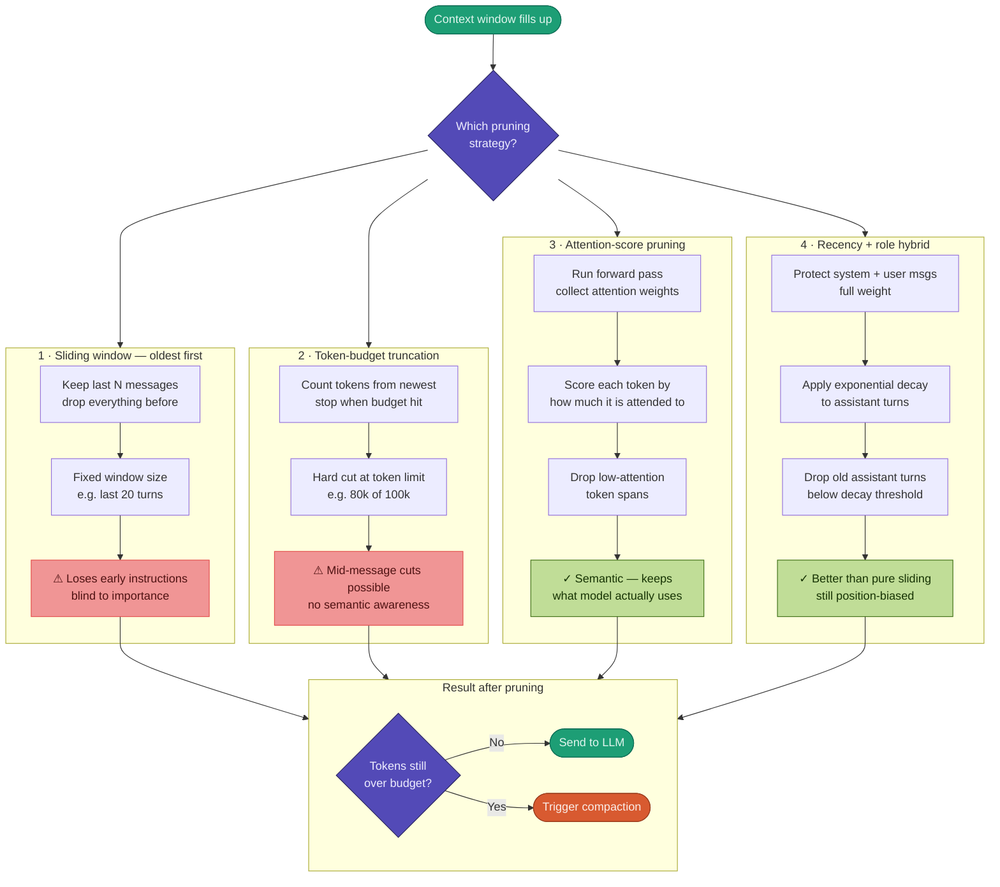

# Current Pruning & Compaction Techniques — Mermaid Diagrams

---

## Pruning Techniques

```mermaid
flowchart TD
    START([Context window fills up]) --> CHECK{Which pruning\nstrategy?}

    CHECK --> SW
    CHECK --> TOP
    CHECK --> ATT
    CHECK --> RECENCY

    subgraph SW["1 · Sliding window — oldest first"]
        SW1[Keep last N messages\ndrop everything before]
        SW2[Fixed window size\ne.g. last 20 turns]
        SW3["⚠ Loses early instructions\nblind to importance"]
        SW1 --> SW2 --> SW3
    end

    subgraph TOP["2 · Token-budget truncation"]
        TOP1[Count tokens from newest\nstop when budget hit]
        TOP2[Hard cut at token limit\ne.g. 80k of 100k]
        TOP3["⚠ Mid-message cuts possible\nno semantic awareness"]
        TOP1 --> TOP2 --> TOP3
    end

    subgraph ATT["3 · Attention-score pruning"]
        ATT1[Run forward pass\ncollect attention weights]
        ATT2[Score each token by\nhow much it is attended to]
        ATT3[Drop low-attention\ntoken spans]
        ATT4["✓ Semantic — keeps\nwhat model actually uses"]
        ATT1 --> ATT2 --> ATT3 --> ATT4
    end

    subgraph RECENCY["4 · Recency + role hybrid"]
        R1[Protect system + user msgs\nfull weight]
        R2[Apply exponential decay\nto assistant turns]
        R3[Drop old assistant turns\nbelow decay threshold]
        R4["✓ Better than pure sliding\nstill position-biased"]
        R1 --> R2 --> R3 --> R4
    end

    SW3 & TOP3 & ATT4 & R4 --> RESULT

    subgraph RESULT["Result after pruning"]
        RES1{Tokens still\nover budget?}
        RES1 -- No --> DONE([Send to LLM])
        RES1 -- Yes --> COMPACT([Trigger compaction])
    end

    style START fill:#1D9E75,stroke:#0F6E56,color:#E1F5EE
    style DONE fill:#1D9E75,stroke:#0F6E56,color:#E1F5EE
    style COMPACT fill:#D85A30,stroke:#993C1D,color:#FAECE7
    style RES1 fill:#534AB7,stroke:#26215C,color:#EEEDFE
    style CHECK fill:#534AB7,stroke:#26215C,color:#EEEDFE
    style SW3 fill:#F09595,stroke:#E24B4A,color:#501313
    style TOP3 fill:#F09595,stroke:#E24B4A,color:#501313
    style ATT4 fill:#C0DD97,stroke:#3B6D11,color:#173404
    style R4 fill:#C0DD97,stroke:#3B6D11,color:#173404
```

---

## Compaction Techniques

```mermaid
flowchart TD
    START([Pruning done — still over budget]) --> PICK{Compaction\nmethod?}

    PICK --> SUM
    PICK --> RAG
    PICK --> HIER
    PICK --> MEM

    subgraph SUM["1 · LLM summarisation — most common"]
        S1[Take oldest N messages\nas a chunk]
        S2[Send chunk to LLM with\nsummarise prompt]
        S3[Replace N messages\nwith 1 summary message]
        S4[Summary inherits\nmax weight of chunk]
        S5["✓ Used in: LangChain\nAutogen, Claude Projects"]
        S1 --> S2 --> S3 --> S4 --> S5
    end

    subgraph RAG["2 · RAG offload — retrieval augmented"]
        R1[Move old messages\ninto vector store]
        R2[Embed each message\nwith sentence-transformer]
        R3[On each new turn\nretrieve top-k by similarity]
        R4[Inject retrieved chunks\nback into context]
        R5["✓ Nothing deleted\nused in MemGPT / Letta"]
        R1 --> R2 --> R3 --> R4 --> R5
    end

    subgraph HIER["3 · Hierarchical summarisation"]
        H1[Summarise in chunks\ne.g. every 10 turns]
        H2[Summaries of summaries\nfor very long runs]
        H3[Keep full recent window\nappend rolling summary]
        H4["✓ Scales to 1000+ turns\nlong agent runs"]
        H1 --> H2 --> H3 --> H4
    end

    subgraph MEM["4 · Structured memory extraction"]
        M1[LLM reads context\nextracts key facts]
        M2[Store as key-value pairs\ntask goal, user prefs]
        M3[Discard raw messages\nkeep structured facts only]
        M4[Re-inject memory block\nat top of every prompt]
        M5["✓ Used in: ChatGPT memory\nClaude memory feature"]
        M1 --> M2 --> M3 --> M4 --> M5
    end

    SUM & RAG & HIER & MEM --> AFTER

    subgraph AFTER["After compaction"]
        A1{Budget\nmet?}
        A1 -- Yes --> DONE([Context sent to LLM])
        A1 -- No --> REPEAT[Repeat on\nnext oldest chunk]
        REPEAT --> A1
    end

    style START fill:#D85A30,stroke:#993C1D,color:#FAECE7
    style DONE fill:#1D9E75,stroke:#0F6E56,color:#E1F5EE
    style A1 fill:#534AB7,stroke:#26215C,color:#EEEDFE
    style PICK fill:#534AB7,stroke:#26215C,color:#EEEDFE
    style S5 fill:#C0DD97,stroke:#3B6D11,color:#173404
    style R5 fill:#C0DD97,stroke:#3B6D11,color:#173404
    style H4 fill:#C0DD97,stroke:#3B6D11,color:#173404
    style M5 fill:#C0DD97,stroke:#3B6D11,color:#173404
    style REPEAT fill:#FAC775,stroke:#854F0B,color:#412402
```

